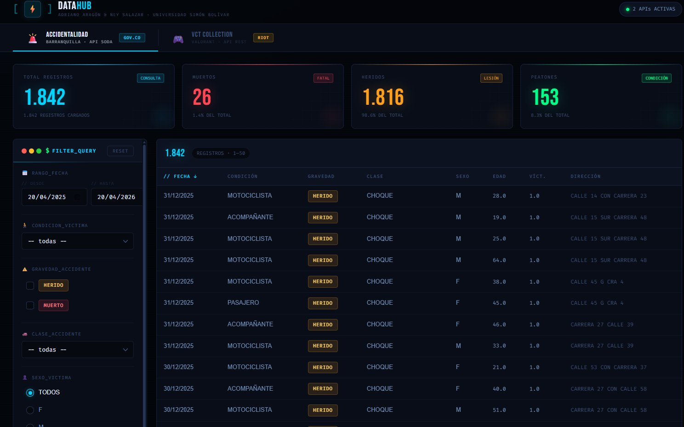
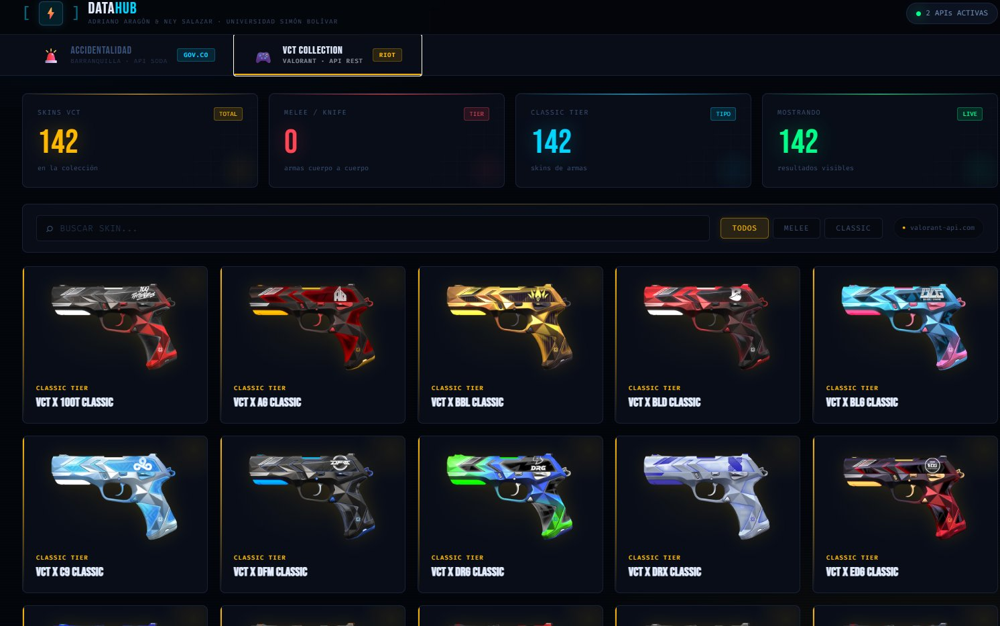

#  DATAHUB — Sistema de Visualización de Datos Unificado

**Adriano Aragón & Ney Salazar · Universidad Simón Bolívar**

DataHub es una plataforma web de visualización de datos en tiempo real que integra dos fuentes de datos completamente distintas en una interfaz unificada de estética dark-tech: datos de **accidentalidad vial en Barranquilla** (vía API SODA del gobierno colombiano) y la **colección de skins VCT de Valorant** (vía API REST de Riot Games).

---

##  Screenshots

### Módulo 1 — Accidentalidad Barranquilla



### Módulo 2 — VCT Collection (Valorant)



---

##  Estructura de Archivos

```
datahub/
├── index.html          # Aplicación principal (HTML + lógica embebida)
├── styles.css          # Hoja de estilos global (design system dark)
├── app.js              # Lógica JavaScript separada (fetch, filtros, render)
└── README.md           # Este archivo
```

---

##  Tecnologías Utilizadas

| Tecnología | Uso |
|---|---|
| HTML5 / CSS3 | Estructura y diseño visual |
| JavaScript (Vanilla ES6+) | Lógica de negocio, fetch, filtros, render |
| API SODA (Socrata) | Datos de accidentalidad de Barranquilla |
| API REST Riot / Valorant | Colección de skins VCT |
| CSS Custom Properties | Design tokens del sistema visual |
| CSS Grid / Flexbox | Layout adaptable |

---

##  APIs Consumidas

### 1. API SODA — Accidentalidad Barranquilla

- **Fuente:** Datos Abiertos Colombia (`gov.co`)
- **Endpoint base:** `https://www.datos.gov.co/resource/`
- **Protocolo:** SODA (Socrata Open Data API) sobre HTTP/HTTPS
- **Formato:** JSON
- **Autenticación:** Ninguna (pública)
- **Parámetros soportados:**
  - `$where` — filtros por fecha, condición, gravedad, clase, sexo
  - `$limit` / `$offset` — paginación
  - `$order` — ordenamiento
- **Campos principales utilizados:**

| Campo | Descripción |
|---|---|
| `fecha_accidente` | Fecha del evento (ISO 8601) |
| `condicion_victima` | Rol de la víctima (motociclista, peatón, etc.) |
| `gravedad_accidente` | Resultado (HERIDO / MUERTO) |
| `clase_accidente` | Tipo de accidente (choque, atropello, etc.) |
| `sexo_victima` | Sexo de la víctima (M / F) |
| `edad_victima` | Edad en años |
| `cantidad_victimas` | Número de víctimas en el registro |
| `direccion` | Dirección del accidente |

---

### 2. API REST — Valorant VCT Collection (Riot Games)

- **Fuente:** `valorant-api.com` (API no oficial / community)
- **Endpoint:** `https://valorant-api.com/v1/weapons/skinchromas`
- **Protocolo:** REST sobre HTTPS
- **Formato:** JSON
- **Autenticación:** Ninguna (pública)
- **Filtrado aplicado:** Solo se muestran skins cuyo nombre contenga `VCT` (colección oficial de equipos de esports)

**Campos utilizados:**

| Campo | Descripción |
|---|---|
| `displayName` | Nombre de la skin |
| `displayIcon` | URL de la imagen |
| `fullRender` | Render completo de la skin |
| `uuid` | Identificador único |

---

##  Módulos de la Aplicación

### Módulo ACCIDENTALIDAD

Visualización interactiva de registros de accidentalidad vial en Barranquilla, Colombia.

**KPIs mostrados:**
- **Total Registros** — cantidad total de eventos cargados
- **Muertos** — víctimas fatales y su porcentaje
- **Heridos** — víctimas con lesiones y su porcentaje
- **Peatones** — víctimas en condición de peatón y su porcentaje

**Panel de Filtros:**
- Rango de fechas (desde / hasta)
- Condición de la víctima (`-- todas --` o categoría específica)
- Gravedad del accidente (HERIDO / MUERTO, selección múltiple)
- Clase de accidente (`-- todas --` o tipo específico)
- Sexo de la víctima (Todos / F / M)
- Rango de edad (mín / máx)

**Tabla de Datos:**
- Paginación de 50 registros por página
- Columnas: Fecha, Condición, Gravedad, Clase, Sexo, Edad, Víct., Dirección
- Gravedad coloreada con badges (HERIDO en ámbar, MUERTO en rojo)

---

### Módulo VCT COLLECTION

Galería de skins de armas de la colección oficial VCT (Valorant Champions Tour) de Riot Games.

**KPIs mostrados:**
- **Skins VCT** — total de skins en la colección
- **Melee / Knife** — armas cuerpo a cuerpo disponibles
- **Classic Tier** — skins de tipo Classic (pistola base)
- **Mostrando** — resultados visibles según filtro activo

**Controles:**
- Buscador por nombre de skin o equipo (ej: `Cloud9`, `DRX`, `100T`)
- Filtros rápidos: TODOS / MELEE / CLASSIC
- Link directo a `valorant-api.com`

**Galería:**
- Grid responsivo de 5 columnas
- Cards con imagen renderizada, nombre y tier
- Animación de entrada escalonada (`cardIn`)
- Hover con efecto de brillo y zoom

---

##  Sistema de Diseño

El proyecto usa un design system propio con variables CSS centralizadas:

```css
/* Paleta principal */
--cyan:   #00D4FF   /* KPI primario / acento */
--red:    #FF4655   /* Fatal / Muerto */
--amber:  #FF9F1C   /* Herido / advertencia */
--green:  #00FF88   /* Condición / activo */
--gold:   #FFB800   /* VCT / highlight */

/* Fondos */
--bg:     #080B10   /* Fondo base */
--panel:  #0E1218   /* Tarjetas y paneles */
--line2:  #1E2530   /* Bordes */

/* Tipografías */
--ff-c: 'Courier New', monospace   /* Etiquetas y UI */
--ff-d: 'Arial Black', sans-serif  /* Números KPI */
```

---

##  Cómo Ejecutar

El proyecto es **100% estático** — no requiere servidor backend, instalación de dependencias ni build.

**Opción 1 — Abrir directamente:**
```bash
# Simplemente abrir index.html en cualquier navegador moderno
open index.html
```

**Opción 2 — Servidor local (recomendado para evitar CORS):**
```bash
# Con Python
python -m http.server 8080

# Con Node.js
npx serve .
```
Luego navegar a `http://localhost:8080`

> **Nota:** Ambas APIs son públicas y no requieren llaves de acceso. Se necesita conexión a internet para cargar los datos en tiempo real.

---

##  Notas Técnicas

- Los datos de accidentalidad se consultan **en tiempo real** con cada sesión; no hay caché persistente.
- La colección VCT se filtra del catálogo completo de Valorant buscando skins con `VCT` en el nombre.
- El diseño es responsivo con breakpoints para pantallas desde 1280px en adelante.
- No se utilizan frameworks externos (sin React, sin Vue, sin jQuery) — JavaScript puro ES6+.

---

##  Autores

| Nombre | Institución |
|---|---|
| Adriano Aragón | Universidad Simón Bolívar |
| Ney Salazar | Universidad Simón Bolívar |

---

*DataHub · Especial VCT 2026 · Barranquilla, Colombia*
